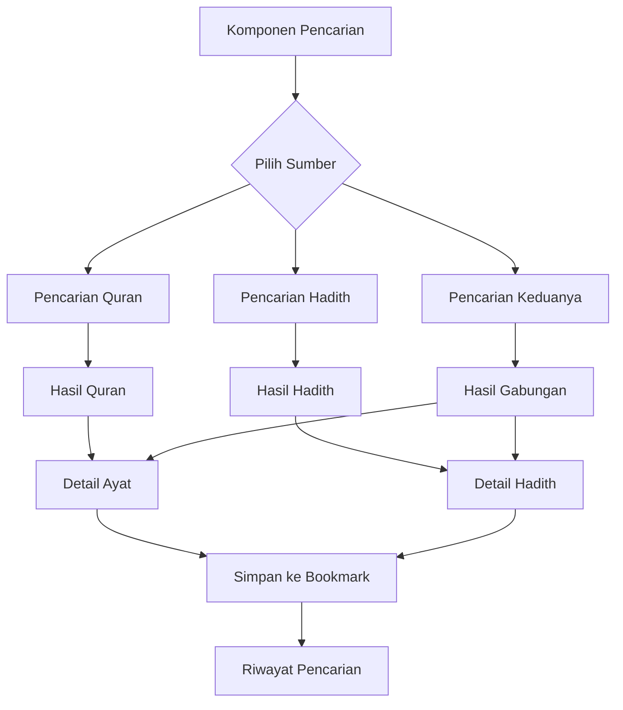

# Fitur Pencarian Kata - Quran dan Hadith

## 1. Product Overview
Fitur pencarian kata yang memungkinkan pengguna mencari kata atau frasa spesifik dalam teks Arab di bagian Quran dan Hadith dengan hasil yang akurat dan cepat.
- Menyelesaikan masalah kesulitan menemukan ayat atau hadith berdasarkan kata kunci tertentu dalam dataset teks Arab yang besar.
- Target: Meningkatkan pengalaman pengguna dalam eksplorasi dan studi teks keagamaan dengan efisiensi pencarian yang tinggi.

## 2. Core Features

### 2.1 User Roles
| Role | Registration Method | Core Permissions |
|------|---------------------|------------------|
| Guest User | Tidak perlu registrasi | Dapat melakukan pencarian dasar di Quran dan Hadith |
| Authenticated User | Login dengan Google | Dapat menyimpan riwayat pencarian, bookmark hasil pencarian |

### 2.2 Feature Module
Fitur pencarian kata terdiri dari halaman dan komponen berikut:
1. **Komponen Pencarian Universal**: input pencarian dengan saran real-time, filter pencarian lanjutan.
2. **Halaman Hasil Pencarian Quran**: tampilan hasil pencarian ayat dengan highlight kata yang dicari.
3. **Halaman Hasil Pencarian Hadith**: tampilan hasil pencarian hadith dengan highlight kata yang dicari.
4. **Panel Riwayat Pencarian**: daftar pencarian sebelumnya untuk pengguna yang login.

### 2.3 Page Details
| Page Name | Module Name | Feature description |
|-----------|-------------|---------------------|
| Search Component | Input Pencarian | Input teks dengan autocomplete, dropdown saran kata, validasi input Arab |
| Search Component | Filter Lanjutan | Pilihan pencarian eksak/parsial, filter berdasarkan surah/koleksi hadith |
| Quran Search Results | Hasil Pencarian | Tampilkan ayat yang cocok dengan highlight kata, navigasi antar hasil |
| Quran Search Results | Detail Ayat | Tampilkan konteks ayat lengkap, terjemahan, tafsir singkat |
| Hadith Search Results | Hasil Pencarian | Tampilkan hadith yang cocok dengan highlight kata, navigasi antar hasil |
| Hadith Search Results | Detail Hadith | Tampilkan hadith lengkap dengan sanad, terjemahan, klasifikasi |
| Search History | Riwayat Pencarian | Simpan dan tampilkan pencarian sebelumnya, hapus riwayat |
| Search History | Bookmark Hasil | Simpan hasil pencarian favorit, organisasi bookmark |

## 3. Core Process
**Alur Pencarian Umum:**
1. Pengguna memasukkan kata kunci di komponen pencarian
2. Sistem memberikan saran real-time berdasarkan input
3. Pengguna memilih opsi pencarian (Quran/Hadith/Keduanya)
4. Sistem menampilkan hasil dengan highlight kata yang dicari
5. Pengguna dapat menavigasi antar hasil dan melihat detail lengkap
6. Pengguna yang login dapat menyimpan pencarian ke riwayat

**Alur Pencarian Lanjutan:**
1. Pengguna mengakses filter pencarian lanjutan
2. Mengatur parameter pencarian (eksak/parsial, surah/koleksi tertentu)
3. Sistem melakukan pencarian dengan kriteria yang ditentukan
4. Hasil ditampilkan dengan informasi filter yang digunakan

## 4. User Interface Design
### 4.1 Design Style
- Primary colors: Hijau (#4ade80) untuk elemen pencarian aktif
- Secondary colors: Abu-abu (#f3f4f6) untuk background hasil
- Button style: Rounded dengan shadow halus
- Font: Inter untuk UI, Amiri untuk teks Arab
- Layout style: Card-based untuk hasil pencarian, sticky search bar
- Icon style: Lucide icons untuk konsistensi dengan aplikasi existing

### 4.2 Page Design Overview
| Page Name | Module Name | UI Elements |
|-----------|-------------|-------------|
| Search Component | Input Pencarian | Search bar dengan icon kaca pembesar, dropdown autocomplete dengan highlight, loading spinner |
| Search Component | Filter Lanjutan | Toggle buttons untuk jenis pencarian, dropdown surah/koleksi, checkbox opsi pencarian |
| Quran Search Results | Hasil Pencarian | Card layout dengan ayat Arab, terjemahan, nomor surah:ayat, highlight kuning untuk kata yang dicari |
| Hadith Search Results | Hasil Pencarian | Card layout dengan teks hadith, terjemahan, nama perawi, highlight kuning untuk kata yang dicari |
| Search History | Riwayat | List item dengan timestamp, kata kunci, jumlah hasil, tombol hapus |

### 4.3 Responsiveness
Design mobile-first dengan adaptasi desktop, optimasi touch interaction untuk navigasi hasil pencarian di mobile, sticky search bar untuk akses cepat.
