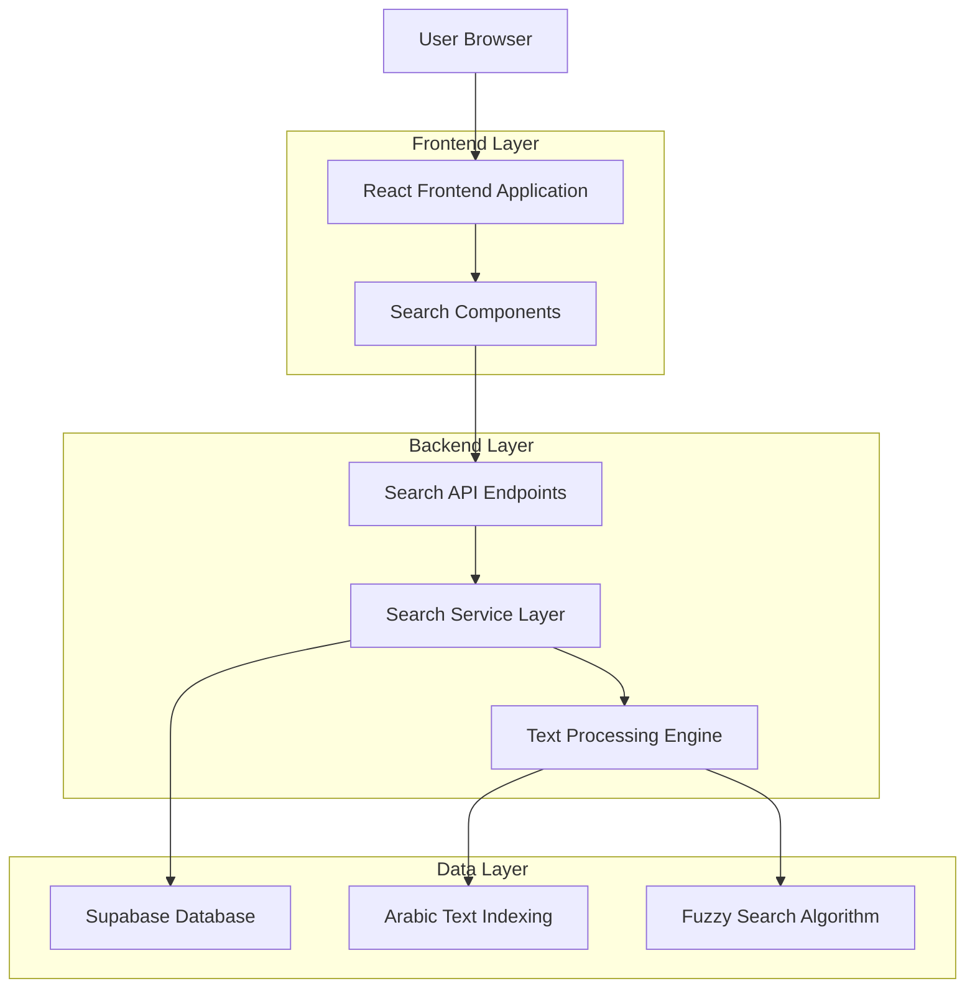
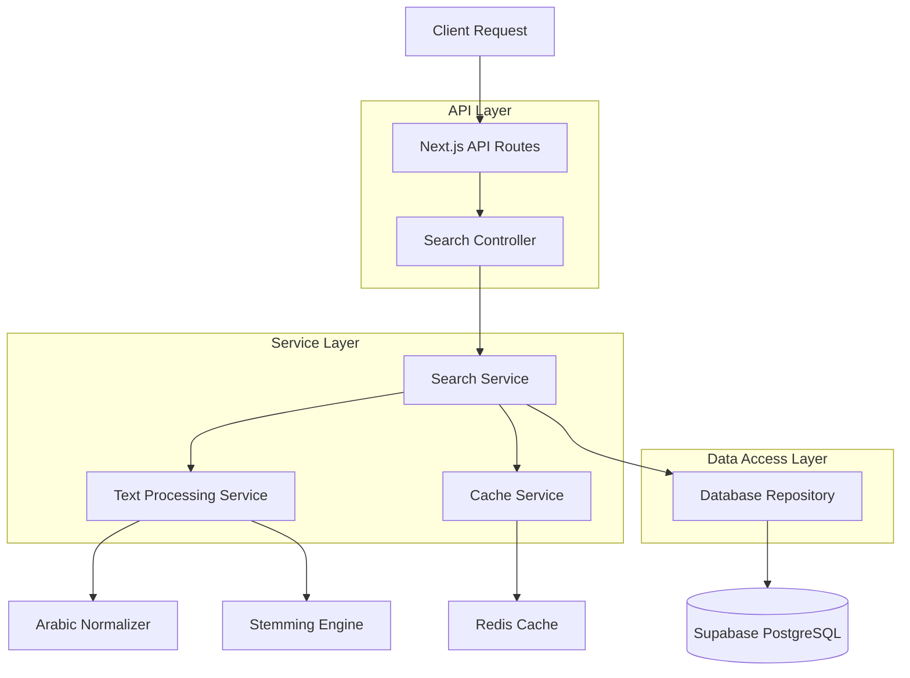
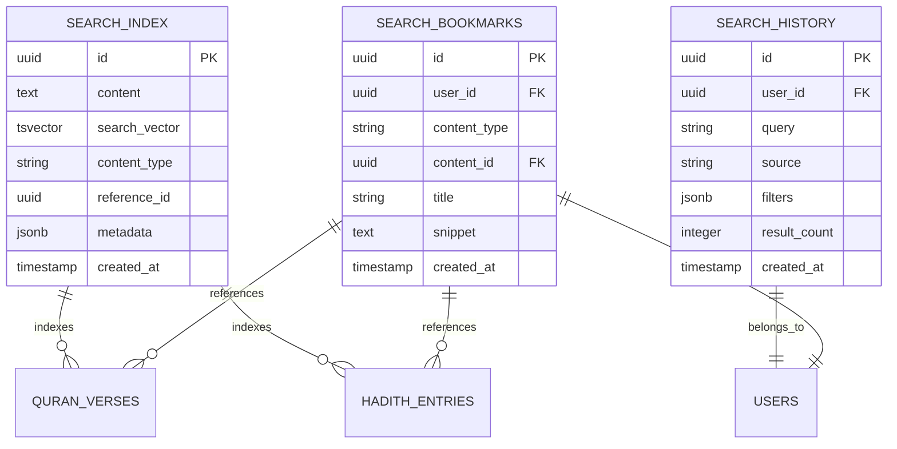

# Arsitektur Teknis - Fitur Pencarian Kata

## 1. Architecture Design



## 2. Technology Description
- Frontend: React@18 + TypeScript + Tailwind CSS + Vite
- Backend: Next.js API Routes + Node.js
- Database: Supabase (PostgreSQL) dengan Full-Text Search
- Search Engine: PostgreSQL tsvector + Custom Arabic text processing
- Caching: Redis untuk hasil pencarian yang sering diakses

## 3. Route Definitions
| Route | Purpose |
|-------|---------|
| /search | Halaman pencarian universal dengan tab Quran/Hadith |
| /search/quran | Hasil pencarian khusus Quran |
| /search/hadith | Hasil pencarian khusus Hadith |
| /search/history | Riwayat pencarian pengguna |

## 4. API Definitions

### 4.1 Core Search API

**Pencarian Universal**
```
POST /api/search
```

Request:
| Param Name | Param Type | isRequired | Description |
|------------|------------|------------|-------------|
| query | string | true | Kata kunci pencarian (Arab/Indonesia) |
| source | enum | true | 'quran', 'hadith', 'both' |
| searchType | enum | false | 'exact', 'partial', 'fuzzy' (default: 'partial') |
| filters | object | false | Filter tambahan (surah, koleksi hadith, dll) |
| page | number | false | Nomor halaman (default: 1) |
| limit | number | false | Jumlah hasil per halaman (default: 20) |

Response:
| Param Name | Param Type | Description |
|------------|------------|-------------|
| results | array | Array hasil pencarian |
| totalCount | number | Total jumlah hasil |
| currentPage | number | Halaman saat ini |
| totalPages | number | Total halaman |
| searchTime | number | Waktu pencarian dalam ms |

Example Request:
```json
{
  "query": "الله",
  "source": "both",
  "searchType": "partial",
  "filters": {
    "surah": [1, 2],
    "hadithCollection": ["bukhari", "muslim"]
  },
  "page": 1,
  "limit": 20
}
```

Example Response:
```json
{
  "results": [
    {
      "type": "quran",
      "surahId": 1,
      "ayahNumber": 1,
      "arabicText": "بِسْمِ اللَّهِ الرَّحْمَٰنِ الرَّحِيمِ",
      "translation": "Dengan nama Allah Yang Maha Pengasih lagi Maha Penyayang",
      "highlights": ["اللَّهِ"],
      "matchScore": 0.95
    }
  ],
  "totalCount": 156,
  "currentPage": 1,
  "totalPages": 8,
  "searchTime": 45
}
```

**Saran Pencarian (Autocomplete)**
```
GET /api/search/suggestions
```

Request:
| Param Name | Param Type | isRequired | Description |
|------------|------------|------------|-------------|
| q | string | true | Input parsial dari pengguna |
| source | enum | false | 'quran', 'hadith', 'both' (default: 'both') |
| limit | number | false | Jumlah saran (default: 10) |

**Riwayat Pencarian**
```
GET /api/search/history
POST /api/search/history
DELETE /api/search/history/{id}
```

## 5. Server Architecture Diagram



## 6. Data Model

### 6.1 Data Model Definition



### 6.2 Data Definition Language

**Search Index Table**
```sql
-- Create search index table
CREATE TABLE search_index (
    id UUID PRIMARY KEY DEFAULT gen_random_uuid(),
    content TEXT NOT NULL,
    search_vector tsvector,
    content_type VARCHAR(20) NOT NULL CHECK (content_type IN ('quran', 'hadith')),
    reference_id UUID NOT NULL,
    metadata JSONB DEFAULT '{}',
    created_at TIMESTAMP WITH TIME ZONE DEFAULT NOW()
);

-- Create GIN index for full-text search
CREATE INDEX idx_search_vector ON search_index USING GIN(search_vector);
CREATE INDEX idx_search_content_type ON search_index(content_type);
CREATE INDEX idx_search_reference_id ON search_index(reference_id);

-- Function to update search vector
CREATE OR REPLACE FUNCTION update_search_vector()
RETURNS TRIGGER AS $$
BEGIN
    NEW.search_vector := to_tsvector('arabic', NEW.content);
    RETURN NEW;
END;
$$ LANGUAGE plpgsql;

-- Trigger to automatically update search vector
CREATE TRIGGER trigger_update_search_vector
    BEFORE INSERT OR UPDATE ON search_index
    FOR EACH ROW EXECUTE FUNCTION update_search_vector();
```

**Search History Table**
```sql
-- Create search history table
CREATE TABLE search_history (
    id UUID PRIMARY KEY DEFAULT gen_random_uuid(),
    user_id UUID NOT NULL REFERENCES auth.users(id) ON DELETE CASCADE,
    query VARCHAR(500) NOT NULL,
    source VARCHAR(20) NOT NULL CHECK (source IN ('quran', 'hadith', 'both')),
    filters JSONB DEFAULT '{}',
    result_count INTEGER DEFAULT 0,
    created_at TIMESTAMP WITH TIME ZONE DEFAULT NOW()
);

-- Create indexes
CREATE INDEX idx_search_history_user_id ON search_history(user_id);
CREATE INDEX idx_search_history_created_at ON search_history(created_at DESC);
```

**Search Bookmarks Table**
```sql
-- Create search bookmarks table
CREATE TABLE search_bookmarks (
    id UUID PRIMARY KEY DEFAULT gen_random_uuid(),
    user_id UUID NOT NULL REFERENCES auth.users(id) ON DELETE CASCADE,
    content_type VARCHAR(20) NOT NULL CHECK (content_type IN ('quran', 'hadith')),
    content_id UUID NOT NULL,
    title VARCHAR(200) NOT NULL,
    snippet TEXT,
    created_at TIMESTAMP WITH TIME ZONE DEFAULT NOW()
);

-- Create indexes
CREATE INDEX idx_search_bookmarks_user_id ON search_bookmarks(user_id);
CREATE INDEX idx_search_bookmarks_content ON search_bookmarks(content_type, content_id);
```

**Row Level Security (RLS) Policies**
```sql
-- Enable RLS
ALTER TABLE search_history ENABLE ROW LEVEL SECURITY;
ALTER TABLE search_bookmarks ENABLE ROW LEVEL SECURITY;

-- Policies for search_history
CREATE POLICY "Users can view own search history" ON search_history
    FOR SELECT USING (auth.uid() = user_id);

CREATE POLICY "Users can insert own search history" ON search_history
    FOR INSERT WITH CHECK (auth.uid() = user_id);

CREATE POLICY "Users can delete own search history" ON search_history
    FOR DELETE USING (auth.uid() = user_id);

-- Policies for search_bookmarks
CREATE POLICY "Users can manage own bookmarks" ON search_bookmarks
    FOR ALL USING (auth.uid() = user_id);

-- Grant permissions
GRANT SELECT ON search_index TO anon, authenticated;
GRANT ALL ON search_history TO authenticated;
GRANT ALL ON search_bookmarks TO authenticated;
```

**Initial Data Population**
```sql
-- Populate search index with existing Quran data
INSERT INTO search_index (content, content_type, reference_id, metadata)
SELECT 
    arabic_text as content,
    'quran' as content_type,
    id as reference_id,
    jsonb_build_object(
        'surah_id', surah_id,
        'ayah_number', ayah_number,
        'translation', translation
    ) as metadata
FROM quran_verses;

-- Populate search index with existing Hadith data
INSERT INTO search_index (content, content_type, reference_id, metadata)
SELECT 
    arabic_text as content,
    'hadith' as content_type,
    id as reference_id,
    jsonb_build_object(
        'collection', collection,
        'book', book,
        'hadith_number', hadith_number,
        'translation', translation
    )